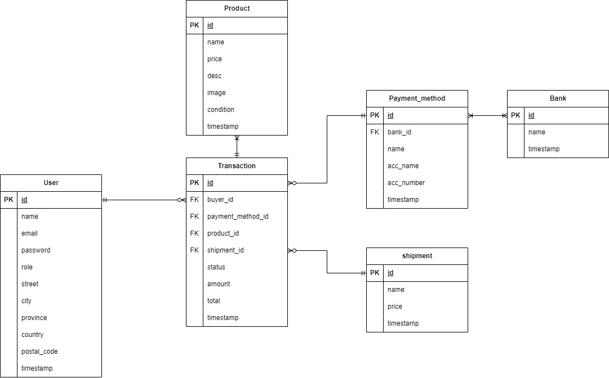

# DOT Intern Chalange

- Demo Video: 
- Api Collection (Postman): [ApiCollection]

Saya menggunakan design pattern MVC (Model-View-Controller) dalam NestJS selain karena lebih familiar dengan pattern ini, saya menggunakan pattern ini karena memberikan berbagai keuntungan, termasuk pemisahan tanggung jawab yang memisahkan logika aplikasi menjadi Model (data dan aturan bisnis), View (presentasi data), dan Controller (pengendali logika dan interaksi pengguna). Dengan memisahkan komponen, pengujian unit dan integrasi menjadi lebih mudah dilakukan. Arsitektur ini juga mendukung penggunaan kembali kode dengan komponen yang terdefinisi dengan baik.


## Tech Stack
- NestJS
- MySQL
- Prisma

## Installation

```sh
cd dillinger
npm install
npx prisma
npm run seed
npm run dev 
```
## User
### Admin
- email: admin@gmail.com
- password: test
### Customer
- email: customer@gmail.com
- password: test


[ApiCollection]: <http://jquery.com>